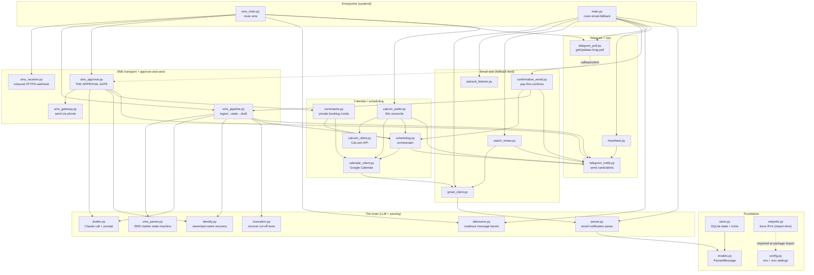

# ARCHITECTURE.md — rover-autoresponder

A maintenance map of the auto-responder + calendar subsystem: what each module does,
how they wire together at runtime, and **where to look when something breaks**. This is
derived from the code (not the design docs) as of the current tree — when this doc and
the code disagree, the code wins; fix this doc and tell Malik.

Read `CLAUDE.md` (this dir) first for the hard rules and the transport reality; read the
root `CLAUDE.md` for shared conventions. The three design docs
(`rover_autoresponder_design.md`, `_addendum_A`, `_calendar_design_addendum_B`) explain
*intent*; this doc explains the *built structure*.

---

## 1. The one-paragraph mental model

A **client texts a Rover relay number**. A Pixel 9a running "SMS Gateway for Android"
POSTs that text to a webhook on the box. The **SMS service** parses it, decides which
screening stage the conversation is in, and — if it's an active inquiry — asks Claude to
draft a reply. The draft is shown as a **card in Telegram**. Nothing is ever sent until
Malik taps **Approve & Send**; then the reply goes back out over SMS through the phone.
When a booking is confirmed, the system drops **PENDING placeholder events** onto a Google
Calendar and texts the client **Cal.com scheduling links**; a 60-second poller watches
Cal.com and flips those placeholders to confirmed times. A **second service reads email**
(ingest-only) to supply the three things SMS can't: full dates-with-year, the phone↔thread
binding, and all booking modifications — plus recovering long texts SMS truncated.

Two long-running processes, one SQLite DB, one Telegram bot, one shared code package.

---

## 2. The processes (this is the top-level structure)

Everything runs inside **two** systemd *user* services (a third is legacy/disabled). Each
"module" below is a file in `autoresponder/`; the services are just entrypoints that wire
modules together and spin up background threads.

| Service (unit) | Entrypoint | Owns | Threads it starts |
|---|---|---|---|
| **rover-sms** | `python -m autoresponder.sms_main --serve` | The whole live SMS pipeline **and the single Telegram poller** | inbound webhook (main thread), debouncer, Cal.com poller, Telegram poller |
| **rover-email-fallback** | `python -m autoresponder.main` (`EMAIL_MODE=fallback`) | Email **ingest only** — feeds truncation recovery, confirmation emails, modifications | Gmail `watch()` daily renewal; Pub/Sub streaming pull (main thread). **No Telegram poll, no drafting.** |
| ~~rover-autoresponder~~ | `python -m autoresponder.main` (no `EMAIL_MODE`) | **Legacy / superseded.** Because `EMAIL_MODE` defaults to `fallback`, running it just duplicates rover-email-fallback. Do not enable alongside rover-sms. | — |

**Critical cross-service fact:** both services share **one SQLite DB** and **one Telegram
bot token**. Only **rover-sms runs the Telegram poller**, so *every* button tap and text
reply is handled there — even taps on a card that **rover-email-fallback** posted (e.g. a
scheduling-links card triggered by a confirmation email). Two pollers on one bot token
would steal each other's updates, which is exactly why fallback mode suppresses its poller.

---

## 3. Module dependency graph

Grouped by layer. `config` and `store` are imported almost everywhere (config = settings,
store = the DB); their edges are omitted to keep the graph readable — assume nearly every
module touches both. Arrows mean "imports / calls".



Reading tips:
- **`sms_main` and `main` are the two roots.** Follow the arrows down from either to see
  exactly what that process pulls in.
- **`scheduling.py` is the calendar hub** — both the SMS path and the email path reach the
  calendar *through it*, never directly.
- **`telegram_notify` (send) and `telegram_poll` (receive) are separate** on purpose, so
  the service stays synchronous. Taps received by `telegram_poll` are dispatched into
  `sms_approve.handle_callback` / `handle_text_reply`.

---

## 4. The runtime journeys (follow a message through the code)

These are the flows you'll actually be debugging. Each names the modules/functions in order.

### 4a. Inbound client SMS → draft → approve → send  *(the main loop)*

```
Phone webhook ─POST─▶ sms_receiver.serve (verify HMAC, dedupe on event id)
   └▶ sms_main.on_event ─(event == "sms:received")─▶ sms_pipeline.handle_sms
         ├─ sms_parser.parse_sms  → marker kind (inquiry / confirmed / modified /
         │                           awaiting_accept / ordinary) + booking-block detect
         ├─ store: upsert thread, start/continue episode, record message
         └─ schedule_draft(number)  → debounce.Debouncer.bump   (coalesce the burst)
                └─(after DEBOUNCE_SECONDS quiet)─▶ sms_pipeline.draft_for_thread
                      ├─ identity.recover_names_from_email   (layer 2, if names missing)
                      ├─ truncation.resolve_truncated        (stitch in full email text)
                      ├─ returning client?  → fixed template, NO LLM call
                      └─ drafter.draft_reply → Claude → {stage, draft_text, flags, ...}
                            └▶ telegram_notify.send_draft_card  (card + Approve keyboard)
                                  store.link_card(message_id → number)

Malik taps a button ─▶ telegram_poll.poll_loop ─▶ sms_approve.handle_callback
   ├─ "send"           → approve_and_send:
   │      store.claim_send (idempotency)  → sms_gateway.send  → store.update_send/outbound
   ├─ "edit"           → next text reply becomes pending_text (apply_edit)
   ├─ warm/short/regen → sms_approve.redraft (drafter again)
   └─ conv/unfit       → terminal status, drafting stops
Delivery webhook (sms:sent/delivered/failed) ─▶ sms_approve.handle_delivery_event
```

Where the decisions live:
- **"Is this an inquiry / confirmation / modification?"** → `sms_parser.py` (regex markers).
- **"Do we draft, and for which episode?"** → `sms_pipeline.handle_sms` (the state machine).
- **"What does the reply say?"** → `drafter.py` + `playbook.md` / `faq.md`.
- **"Can it actually go out?"** → `sms_approve.py` only. **This is the single send path.**

### 4b. Booking confirmed → calendar placeholders → scheduling links

Fires from **either** the SMS confirm marker (`sms_pipeline.handle_sms`, `kind ==
"confirmed"`) **or** the confirmation email (`confirmation_email.handle_confirmation_email`).
Both call the same orchestrator:

```
scheduling.on_booking_confirmed(number, pet, start, end)
   └─ scheduling.create_pending_event ×2 (dropoff + pickup)
        └─ calendar_client.GoogleCalendar.create_event  (TRANSPARENT placeholder on ROVER cal)
   store.add_scheduling_event  (unique per thread+episode+kind → idempotent)
sms_pipeline.send_scheduling_links(number)
   ├─ de-dupe guard:  meta "links_sent:<number>:<episode>"   (both signals can fire)
   ├─ scheduling.build_scheduling_draft → ensure_links → build_link (Cal.com URLs, date-locked)
   └─ telegram_notify.send_draft_card  (fixed template, no LLM — still needs Approve)
```

The **email path supplies authoritative dates with the year**; the SMS path's bare `MM/DD`
gets corrected when the email confirms. Dates parsing lives in
`scheduling.parse_booking_date` (SMS) and `confirmation_email._date` (email).

### 4c. Cal.com reconcile (the 60s poller)

```
calcom_poller.poll_loop (thread in rover-sms)
   └─ poll_once → calcom_client.list_bookings (raises TransientCalcomError on network fail)
        └─ process_bookings:
             match_event   (primary: metadata[ref] = scheduling_events.id;
                             fallback: event-type + date + attendee; ambiguous → ALERT)
             confirm        → placeholder moves to booked time, retitled, OPAQUE
             revert_to_pending  (client cancelled their slot → back to transparent)
```

**Timezone gotcha lives here:** `calcom_poller._local_dt` converts Cal.com's UTC to
`CALENDAR_TIMEZONE` *before* comparing/storing. Skipping it makes evening bookings land a
day late.

### 4d. Email fallback feed (why rover-email-fallback exists)

```
pubsub_listener.listen ─▶ main.handle_notification ─▶ gmail_client.list_history / get_message
   └─ parser.parse_notification  (or confirmation_email in dispatch)
   └─ store.record_message
```

In fallback mode `main.dispatch` / `main.draft_thread` **do not draft and do not touch
thread state** — email exists only to (1) run `confirmation_email` for pay-first bookings,
(2) store full message text so `truncation.resolve_truncated` can stitch it into SMS
threads, and (3) carry modifications. Name/date recovery reaches back into these stored
email rows via `identity` and `truncation`.

### 4e. Private (non-Rover) bookings

Entirely Telegram-driven, no SMS thread: `telegram_poll` → `sms_approve.handle_text_reply`
→ `commands.handle_command` (`/booking`, `/dropoff`, `/movebooking`, …). They use a
synthetic `thread_key` (`private:<slug>`), reuse `scheduling` + `calendar_client`, and never
trigger drafting. See `commands.py` for the full command set.

---

## 5. Where each kind of logic lives (the lookup table)

When you know *what* is wrong but not *where*, start here.

| Concern / symptom | Module(s) | Notes |
|---|---|---|
| Classifying an SMS (inquiry/confirmed/modified/pay-first) | `sms_parser.py` | Regex markers; add new observed variants to `samples/` + a test |
| The screening state machine / episodes | `sms_pipeline.py` (`handle_sms`) | Episode = one booking request within a long-lived number |
| What the drafted reply says | `drafter.py`, `playbook.md`, `faq.md` | Prompt built in `build_system_prompt`; JSON out |
| Stage progression (S0→S3) | `sms_approve.advance_stage` / `main.advance_stage` | Advanced on send |
| **Sending to a client (the only path)** | `sms_approve.py` | Idempotency, delivery confirmation, target labeling |
| Approve/Edit/tone/terminal buttons | `sms_approve.handle_callback`, `telegram_poll` | Buttons defined in `telegram_notify._SMS_BUTTONS` |
| Owner / pet name unknown | `identity.py` | 4 layers: marker → email subject → LLM-inferred → manual `/pet` `/owner` |
| Long message cut off ("more at …") | `truncation.py` + email feed | Matches on **full text**, not a prefix |
| Calendar events (create/update/delete) | `calendar_client.py` | Interface + Google impl; returns None on failure, never raises |
| Placeholder placement, links, titles | `scheduling.py` | The calendar orchestrator; dates parsed here |
| Cal.com booking reconcile / cancel | `calcom_poller.py`, `calcom_client.py` | Poll, don't webhook; UTC→local conversion |
| Pay-first confirmations (email only) | `confirmation_email.py` | Correlates by phone number in the email body |
| Booking modifications (email only) | email feed + `store` / `identity` | SMS never carries date changes |
| Private bookings | `commands.py` | `/booking` etc.; synthetic thread_key |
| Telegram card rendering / budget | `telegram_notify.py` | 4096-char budget; overflow sent as follow-up |
| Telegram receive loop | `telegram_poll.py` | Sync long-poll; only the configured chat id honored |
| Persistence, dedupe, locks | `store.py`, `models.py` | `check_same_thread=False` + `_LOCK` |
| Settings / secrets / feature flags | `config.py`, `.env` | `EMAIL_MODE`, timezone, templates, Cal.com slugs |
| ~16s network stalls (IPv4 fix) | `netprefs.py` | Applied at package import; **do not remove** |
| Liveness / crash alerts | `heartbeat.py`, `main._boot_alert_allowed` | Boot-alert throttle stamp = `*.db.bootalert` |
| Gmail push plumbing | `gmail_client.py`, `pubsub_listener.py`, `watch_renew.py` | 404 on deleted msg = expected |

---

## 6. Data model (SQLite — `rover_autoresponder.db`)

Schema lives in `store.py` (`SCHEMA` + `_MIGRATIONS`). Five tables:

- **`threads`** — keyed by `thread_key` (= the SMS conversation number, or a `replay-…` /
  `private:…` synthetic key). Holds `owner_name`, `pet_name`, `stay_dates`, `stage`,
  `status` (`active|converted|not_suitable|unknown`), `episode`, `has_booked`,
  `email_thread_key`, `pending_text`, `last_draft_text`, `send_status`, `sent_at`, `flags`.
- **`messages`** — one row per inbound/outbound message; `direction`, `truncated`,
  `episode`, `gmail_msg_id` (UNIQUE — also the SMS event dedupe key), `raw_subject`.
- **`sends`** — the **idempotency ledger**. One row per `(thread, exact text)` send claim;
  this is what makes a double-tap physically unable to double-send.
- **`scheduling_events`** — one row per drop-off / pick-up / meet-greet. **UNIQUE
  `(thread_key, episode, kind)`** is the calendar's idempotency guarantee. Carries
  `status` (pending/confirmed/cancelled), `target_date`, `scheduled_at`, `gcal_event_id`,
  `booking_ref` (Cal.com id), `link_url`.
- **`cards`** — maps a Telegram card `message_id` → `thread_key`, so replying to a card
  edits *that* draft.
- **`meta`** — key/value scratch: `last_history_id` (Gmail checkpoint), `watch_expiration`,
  `links_sent:*` de-dupe, `sms_evt:calcom_unmatched:*` alert throttles.

All access goes through `store.py` behind a re-entrant `_LOCK` because worker threads
(Pub/Sub, pollers, Telegram) share one connection.

---

## 7. Non-obvious things that will bite you (pointers)

These are documented in full in `CLAUDE.md` → "Non-obvious invariants"; the short version:

1. **Never add an auto-send path.** `sms_approve.py` is the only transmit path and it runs
   only on an Approve tap. This is the safety keystone.
2. **`netprefs.apply()` must run before any HTTP client is built** (it does, at
   `autoresponder/__init__` import). Removing it reintroduces ~16s stalls on the VM.
3. **Only rover-sms runs the Telegram poller.** Don't add a second poller; don't enable the
   legacy `rover-autoresponder.service` alongside it.
4. **Calendar/date correctness leans on the email feed.** If dates go stale on reschedules,
   suspect the email path, not SMS.
5. **Cal.com times are UTC** — always go through `calcom_poller._local_dt`.
6. **Scheduling-link cards de-dupe per episode** (`links_sent` meta) because both the SMS
   marker and the confirmation email fire for one booking.
7. **48h reminders (C6) do not exist.** There is no scheduler for them. Don't assume they fire.

---

## 8. Testing & tracing

- Full suite: `python -m pytest` from this dir. Tests mirror the modules
  (`test_sms_parser.py`, `test_sms_pipeline.py`, `test_sms_approve.py`, `test_scheduling.py`,
  `test_calcom_poller.py`, `test_confirmation_email.py`, `test_truncation.py`, …).
- **Offline replays** (no phone, no network):
  - `python -m autoresponder.sms_main --replay "+1555…" "text body"` — one SMS through the pipeline.
  - `python -m autoresponder.main --replay samples/yisell_booking_message.txt` — one email.
- `live_scheduling_test.py` hits **real** Cal.com/Calendar — run deliberately, never in CI.
- Reproduce a parser problem by dropping the real message into `samples/` and adding a case
  to `test_sms_parser.py` / `test_parser.py`.

To trace a live problem: the logs are heavily annotated (grep for `NEW INQUIRY`, `DRAFT`,
`SENT`, `CONFIRMED`, `ambiguous`, `EMAIL CONFIRMATION`). Every module logs under its own
`__name__`, so `journalctl --user -u rover-sms` / `-u rover-email-fallback` plus a grep on
the phone number gets you the whole life of a conversation.
